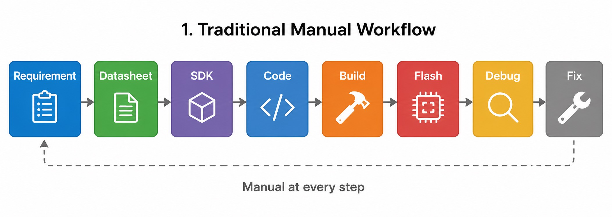
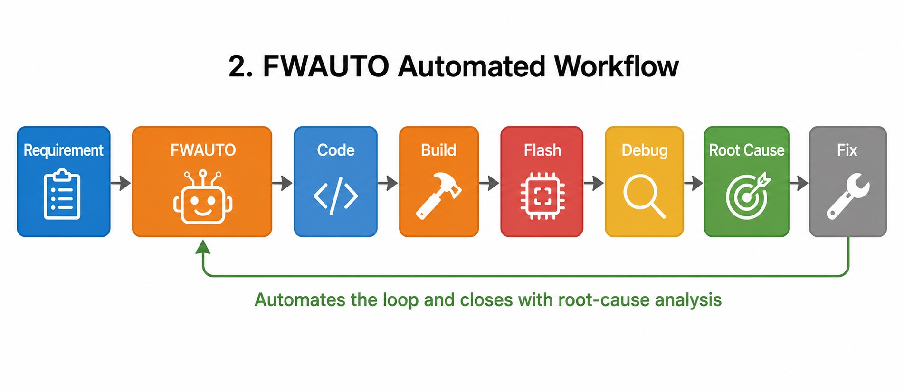
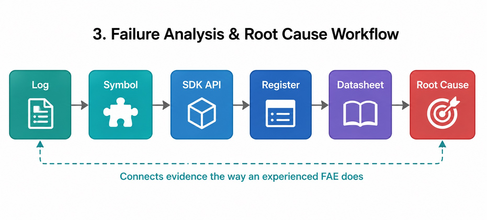

## Hardware setup

Before installing FWAuto, prepare the [Alif E8 DevKit](https://alifsemi.com/support/kits/ensemble-e8devkit/) hardware.

1. Connect the Alif E8 DevKit to your computer using the USB cable.

2. Use the port labeled **JLINK**. This provides both J-Link debug and a virtual COM port.

3. Verify the board is detected:

On Linux:

```bash
ls /dev/ttyACM*
```

You should see a device such as `/dev/ttyACM0`.

On macOS:

```bash
ls /dev/cu.usbmodem*
```

You should see a device such as `/dev/cu.usbmodem1101`.

On Windows, open **Device Manager** and verify you see:
   - **J-Link CDC UART** under Ports (COM & LPT) -- note the COM port number (usually COM3)
   - **SEGGER J-Link** under USB devices

4. Locate the **EN/DIS switch** on the board. Set it to **EN**.

   This switch stays in the EN position at all times. The flashing process enters SE maintenance mode automatically through software -- you never need to change this switch.

## Understanding FWAuto

In the next sections you install [FWAuto](https://fwauto.ai/) and use it to build and flash firmware with the `/build` and `/deploy` commands. This section explains what FWAuto does so you understand what happens behind those commands.

### What FWAuto does

FWAuto is an AI-assisted firmware development tool. It provides a chat interface that can run shell commands, read files, and manage the build-flash-test workflow. You interact with it through natural language or slash commands.

In this Learning Path you use FWAuto for two tasks:

| Command | What it does |
|---------|--------------|
| `/build` | Runs the [CMake](https://cmake.org/) build to compile firmware for the [Cortex-M55](https://developer.arm.com/Processors/Cortex-M55) HE core |
| `/deploy` | Runs the deploy script to flash firmware to the Alif E8 board via SETOOLS |

You can also use `/log` to analyze UART output and `/help` to see all available commands.

### What makes FWAuto different

Unlike a general code assistant that only sees individual files, FWAuto understands the whole firmware project and automates the full loop:

| Capability | What it means |
|------------|---------------|
| Context awareness | Reads the SoC datasheet, SDK API, BSP, Device Tree, RTOS, and driver dependencies, so generated code fits the platform |
| Demo code understanding | Follows the driver flow, init order, and API relationships to extend an existing demo instead of guessing |
| Closed SDK support | Import an SDK, headers, demo, and datasheet to build a project knowledge base (for example Novatek, TI, NXP, MediaTek, Realtek) |
| Build-aware | Understands Makefile, CMake, Kconfig, and Ninja; on failure it locates the file and suggests a fix |
| Flash-aware | Detects the board, switches port, retries, and verifies the flash result |
| Log-aware | Reads UART, kernel, stack trace, assert, panic, HardFault, and WDT logs and explains the cause |
| Auto verification | Runs compile, runtime, log, register, and performance checks after generating code |

Because FWAuto carries project context, verifies its own output, and runs the loop end to end, it can complete several steps in one pass -- reducing the back-and-forth needed to finish a task.

### From requirement to firmware

A traditional workflow is manual at every step:



FWAuto automates the loop and closes it with root-cause analysis:



For a failure, it connects evidence the way an experienced FAE does, rather than giving generic advice:



### How FWAuto understands your project

FWAuto reads your project configuration from `.fwauto/config.toml`. This file tells FWAuto which build system to use, which build target to compile, and how to deploy the firmware. When you run `/build` or `/deploy`, FWAuto reads the config and executes the correct commands.

As a project's knowledge base grows (datasheets, demos, drivers, recorded root causes), later work starts from a stronger baseline -- which also lowers the team's bus factor and speeds up onboarding.

### Chat mode and slash commands

FWAuto supports two ways to trigger actions:

| Method | Example |
|--------|---------|
| Slash commands | `/build`, `/deploy`, `/log` |
| Natural language | "Build the firmware", "Flash the board" |

Both methods produce the same result. Slash commands are shorter; natural language is useful when you want to describe a task in your own words.

## Install FWAuto

Install FWAuto using the official install script.

On Linux and macOS:

```bash
curl -fsSL https://fwauto.ai/install.sh | sh
```

On Windows (PowerShell):

```bash
powershell -ExecutionPolicy ByPass -c "irm https://fwauto.ai/install.ps1 | iex"
```

The script installs the `fwauto` CLI and the AI CLI tools. Verify:

```bash
fwauto --help
```

You should see the FWAuto banner and a list of available commands.

## Authenticate with FWAuto

FWAuto uses Google OAuth for authentication. Run:

```bash
fwauto auth login
```

A browser window opens. Select your Google account and authorize access. After login, verify:

```bash
fwauto auth status
```

You should see output similar to:

```output
Status: Logged in
Email: your.email@example.com
```

## Clone the project repository

Clone the project:

```bash
git clone https://github.com/masonkuomeow/alif_slm_r.git
```

Navigate into the project directory:

```bash
cd alif_slm_r
```

Install the Python dependencies for the web server:

```bash
pip install flask pyserial
```

## Initialize FWAuto in the project

Navigate to the project root and run any FWAuto command to start the setup wizard:

```bash
fwauto build
```

The wizard asks you to configure:

1. **SDK Configuration** -- press Enter to accept the default path
2. **Build Configuration** -- select `command` and enter the CMake build command
3. **Deploy Configuration** -- select `command` and enter the deploy command

After the wizard completes, a `.fwauto/` directory is created:

```console
.fwauto/
  config.toml     # Project configuration
  build/          # Build scripts
  logs/           # Log directory
```

{}
If the wizard does not appear, check that you are inside the `alif_slm_r` directory. FWAuto searches upward for a `.fwauto/` directory.
{}

## Verify your setup

Before proceeding, verify that:

- [ ] Alif E8 board is connected via USB (JLINK port)
- [ ] Board is detected (COM port on Windows, `/dev/ttyACM*` on Linux, `/dev/cu.usbmodem*` on macOS)
- [ ] EN/DIS switch is set to EN
- [ ] Python 3.10+ is installed and on PATH
- [ ] Node.js 20+ is installed and on PATH
- [ ] uv is installed
- [ ] FWAuto is installed and authenticated
- [ ] J-Link software is installed
- [ ] CMake, Ninja, and Arm GCC are installed
- [ ] Project repository is cloned

With the hardware connected and FWAuto configured, you are ready to build and flash the firmware.
