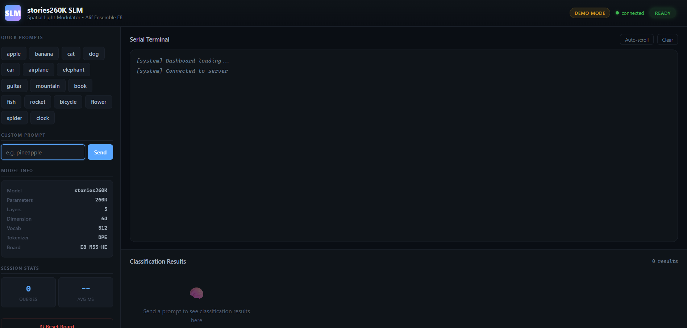

## Start the web GUI and interact with the model

In the previous sections you built and flashed the SLM firmware. In this section you start the [Flask](https://flask.palletsprojects.com/) web server and use the browser dashboard to send prompts to the model. The web GUI provides a user-friendly interface for interacting with the model -- you type prompts in a browser and see responses streamed in real time, without needing a serial terminal.

## Start the web server

Open a terminal, navigate to the project root, and start the server:

```bash
cd alif_slm_r
python web_demo_server.py --serial-port COM3 --no-reset
```

Replace `COM3` with your actual serial port:

| Operating system | Serial port format | Example |
|---|---|---|
| Windows | `COMn` | `COM3` |
| Linux | `/dev/ttyACMn` | `/dev/ttyACM0` |
| macOS | `/dev/cu.usbmodemn` | `/dev/cu.usbmodem1101` |

The `--no-reset` flag tells the server not to toggle DTR/RTS on the serial port. The J-Link CDC UART does not support hardware reset via DTR/RTS.

You should see output similar to:

```output
[SERVER] Starting on http://0.0.0.0:5000
[SERVER] Running in LIVE mode (serial connection to board)

[SERIAL] Auto-detected port: COM3 (J-Link CDC UART)
[SERIAL] Connected to COM3 @ 115200

[STATE] IDLE -> READY
```

The server is now running and connected to the board.

## Open the dashboard

Open your web browser and go to `http://localhost:5000`.

The SLM dashboard shows:

- **Quick prompt buttons** for common words (apple, banana, cat, dog, car)
- **Custom text input** for any prompt
- **Real-time terminal** showing the board's serial output
- **Result cards** showing model output, timing, and timestamps
- **Model info** (260K parameters, 5 layers, dim=64, BPE tokenizer)



## Send your first prompt

1. Click the **cat** quick-prompt button, or type `cat` in the text input field and press Enter.

2. The dashboard shows:
   - The prompt is sent to the board over [UART](https://developer.mozilla.org/en-US/docs/Glossary/UART)
   - The terminal shows `Classifying 'cat'...`
   - The model generates text (this takes about 1.5 to 3.5 seconds)
   - The output appears in the terminal and as a result card

3. The board prints:

   ```output
   Classifying 'cat'...
   Output: lways remember to be careful.
   (1500 ms total, 60.0 ms/token)
   DONE>
   READY>
   ```

4. The dashboard updates automatically via [Server-Sent Events (SSE)](https://developer.mozilla.org/en-US/docs/Web/API/Server-sent_events).

## Try more prompts

The stories260K model is very small (260,000 parameters). It was trained on children's stories, so it generates simple, story-like text continuations.

| Prompt | Expected behavior |
|---|---|
| `cat` | Short text continuation (~1.5s) |
| `dog` | Short text continuation (~1.5s) |
| `apple` | Longer text continuation (~3.5s) |
| `the boy went to` | Story-like continuation |

{}
The model generates text continuations, not factual answers. The output is based on patterns learned from simple children's stories. This is expected behavior for a 260K-parameter model running on a microcontroller.
{}

## Understanding the dashboard

**Terminal panel** -- Shows real-time serial output from the board. Each line is color-coded:
- White: normal output
- Green: `READY>` and `DONE>` markers
- Yellow: system messages

**Result cards** -- Each prompt/response pair displays:
- The prompt text
- The model's generated output
- Inference time in milliseconds
- Per-token timing

**Session statistics** -- Tracks total queries sent and average latency per query.

**Board status** -- Shows the current state:
- IDLE: board is booting
- READY: board is waiting for a prompt
- CLASSIFYING: model is generating text
- DONE: generation complete, transitioning back to READY

## Run in demo mode (optional)

To test the dashboard without a board connected, run in demo mode:

```bash
python web_demo_server.py --demo
```

This simulates board responses with realistic timing. It is useful for UI development or demonstrations.

## Troubleshooting

**Server shows "No board detected"**

- Check that the board is connected via USB (JLINK port)
- Verify the serial port:
  - Windows: check **Device Manager** under Ports (COM & LPT)
  - Linux: check `/dev/ttyACM*`
  - macOS: check `/dev/cu.usbmodem*`
- Make sure no other program is using the serial port (close PuTTY, Tera Term, `screen`, or similar tools)

**Board output shows garbled text**

- The firmware may not be flashed correctly. Repeat the flash steps in the previous section.
- Make sure you built the firmware from `alif_vscode-template/`, not `workshop-ethos-u/`.

**Server starts but shows IDLE state**

- The server may have connected after the board printed `READY>`. It sends a probe newline after 3 seconds and detects the state automatically.
- If it stays in IDLE, click the **Reset Board** button on the dashboard.

**Port access denied**

- Make sure no other terminal program is using the serial port
- On Linux, you may need to add your user to the `dialout` group:

```bash
sudo usermod -aG dialout $USER
```

Log out and log back in for the group change to take effect.

## Summary

You have successfully:

1. Installed all required tools (Python, Node.js, uv, FWAuto, J-Link, CMake, Ninja, Arm GCC)
2. Set up the Alif E8 DevKit hardware and FWAuto development environment
3. Built the SLM firmware from source
4. Flashed the firmware to the Alif E8 board
5. Started a Flask web server connected to the board
6. Opened a browser dashboard and sent prompts to the model
7. Viewed real-time model-generated text in the dashboard
